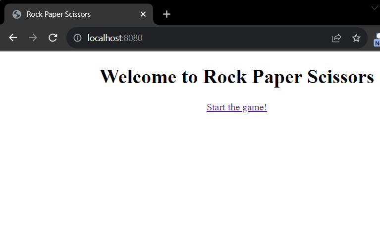
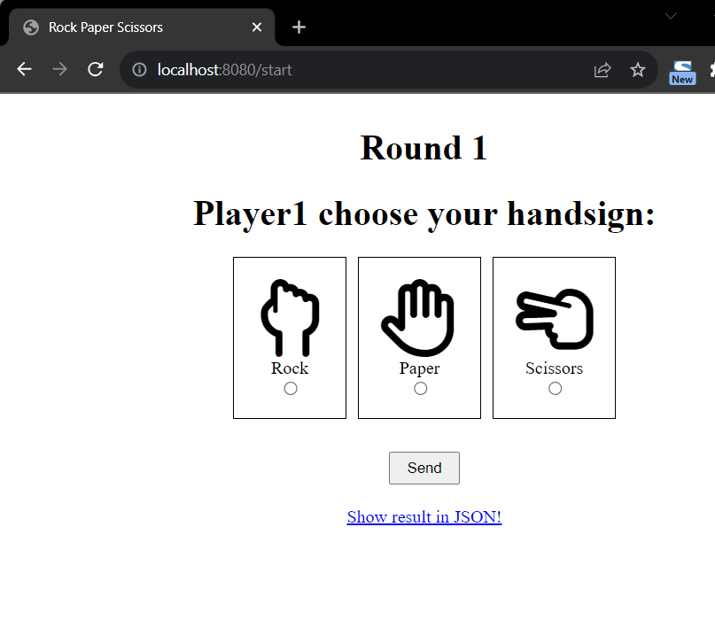
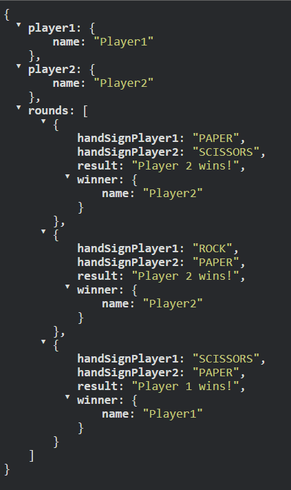
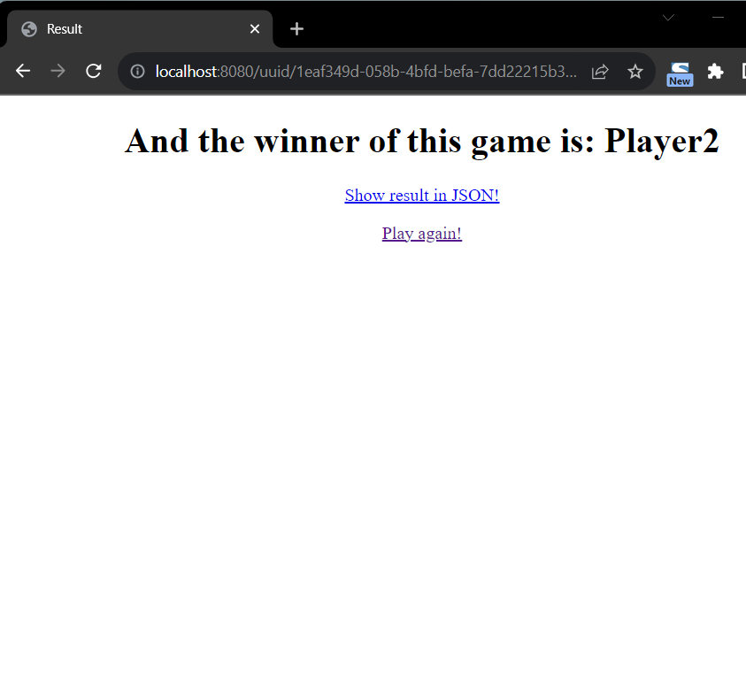

# Code Challenge

## Rules of the Game

Rock, Paper, Scissors is a simple game usually played between two people. The players count to three in unison and simultaneously throw one of three hand signs representing rock, paper, or scissors. The winner of the game is determined by the rules below:

1. **Rock** crushes scissors (Rock wins)
2. **Scissors** cuts paper (Scissors wins)
3. **Paper** covers rock (Paper wins)

- If both players throw the same hand sign, it is a tie and usually the game is played again until a winner is found.

- To simplify only process three rounds and present the result. - Tie or Win based on the three attempts.

## Technologies
* java 17
* springboot 3.1
* web mvc
* tests with junit, assertJ (as provided by springboot)
* Build tool gradle

## Documentation

### Run application
In root directory run 
`./gradlew bootRun`

### testing application
`./gradlew clean test --info`

### Play the game
1. Visit: http://localhost:8080 and `start the game!`
Have fun! :-)

2. Choose your handsign and play alternately

3. In each round you can show results in JSON format by clicking on `show result in JSON`:

4. After three rounds the game ends and the winner will be displayed:

